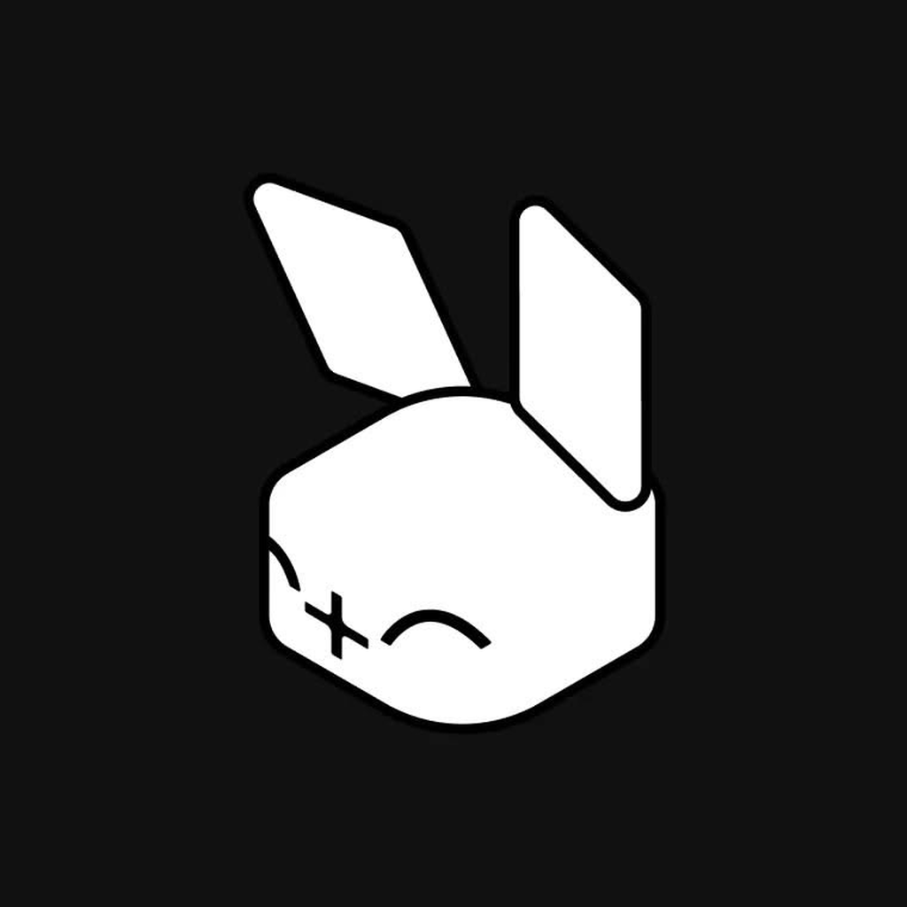

<p align="center">
  
</p>

<h1 align="center">rally.</h1>

<p align="center">
  <strong>Find players, build your gamer ID, play together.</strong><br />
  The gamer-network mobile app · Flutter · Android first
</p>

<p align="center">
  
  
  
</p>

---

## What it is

Rally helps gamers in Addis Ababa find people to play with. You post a
listing ("duo for ranked tonight, voice required"), other players ask to
join, and once you accept a request you can see each other's gaming IDs.

This folder holds the **prototype**, which is the visual and interaction
reference for the MVP. Its data is in-memory mock data, and it is not yet
connected to `apps/api`.

> Owner: Natnael Sisay ([@Natnsis](https://github.com/Natnsis)). Scope lives in
> [`docs/PRD.md`](../../docs/PRD.md), and decisions live in
> [`docs/decisions/`](../../docs/decisions/).

## Features

| | |
| --- | --- |
| 🎮 **Gamer ID** | Pick your games, set a rank or level per game, and choose your platforms (PC, PlayStation, Xbox, Switch, Mobile). |
| 🔎 **Find Players** | Browse open listings, or post your own with game, mode, squad size, voice, time and duration. Listings expire. |
| 🤝 **Connections** | Request to join, and the owner accepts. Gaming IDs unlock only after acceptance. |
| 👥 **Groups** | Community spaces. In the MVP this is a "coming soon" tab with a waitlist. |
| 🔔 **Alerts** | Requests, accepts and activity in one place. |
| 🖼️ **Profile** | Avatar (via `image_picker`), bio, games and ranks, with editing in place. |
| 🕹️ **50+ games** | From Valorant and CS2 to PUBG Mobile, CoD Mobile, eFootball, MLBB and Free Fire, each with its real rank ladder and search aliases. |

## Four skins

The whole UI can be reskinned at runtime. Colours and shadows blend
between skins, and your choice is saved with `shared_preferences`.

| Skin | Feel | Type |
| --- | --- | --- |
| **Inked** | Hard shadows, segment digits | Outfit · DSEG7 |
| **Soft clay** | Pillowy, mint on stone | Plus Jakarta Sans · Manrope |
| **Dot matrix** | Matte black, signal red | Doto · Space Mono · Silkscreen |
| **Glass** | Frosted panels, aurora glow | Space Grotesk |

## Getting started

```bash
cd apps/mobile
flutter pub get
flutter run            # on a connected Android device or emulator
flutter test           # widget tests
```

Regenerate launcher icons after changing `assets/icon/`:

```bash
dart run flutter_launcher_icons
```

## Project layout

```
lib/
├── main.dart          # app entry, theme persistence
├── shell.dart         # screen switcher, header, bottom nav, sheets
├── state.dart         # AppState: navigation, drafts, connections
├── data.dart          # games, ranks, platforms, mock players
├── theme.dart         # RallyTheme + the four skins
├── widgets.dart       # shared UI kit (Pill, cards, backgrounds…)
└── screens/
    ├── onboarding.dart     # landing, login, sign-up, game/rank/platform picks
    ├── games.dart          # game picker UI
    ├── find.dart           # Find Players, alerts, search
    ├── compose.dart        # post a listing
    ├── groups.dart         # communities and group pages
    ├── profile.dart        # player profile
    ├── edit_profile.dart
    └── home.dart           # feed (prototype only, not in the MVP)
assets/
├── fonts/   # bundled typefaces for the skins
├── icon/    # launcher icon sources
└── logo/    # fill + line marks
```

## From prototype to MVP

The prototype covers more than the MVP will ship. Before the real build:

- **No Home feed** ([ADR-0001](../../docs/decisions/0001-mvp-is-find-players-only.md)).
  The bottom nav starts at Find Players.
- **Android first** ([ADR-0002](../../docs/decisions/0002-flutter-android-first.md)).
  iOS comes later from the same code. Push notifications go through FCM.
- **Generated API client.** Models come from
  `packages/api-spec/openapi.json`, so don't hand-write request or
  response models.
- **Safety defaults** ([ADR-0005](../../docs/decisions/0005-safety-defaults.md)).
  Users must be 16+ and give an age range, not a birth date. Every profile
  and listing gets block and report. Sign-in is with Google or an emailed
  code.
- **Naming.** The Dart package is still `rally`. The final product name is
  open (see the PRD).
